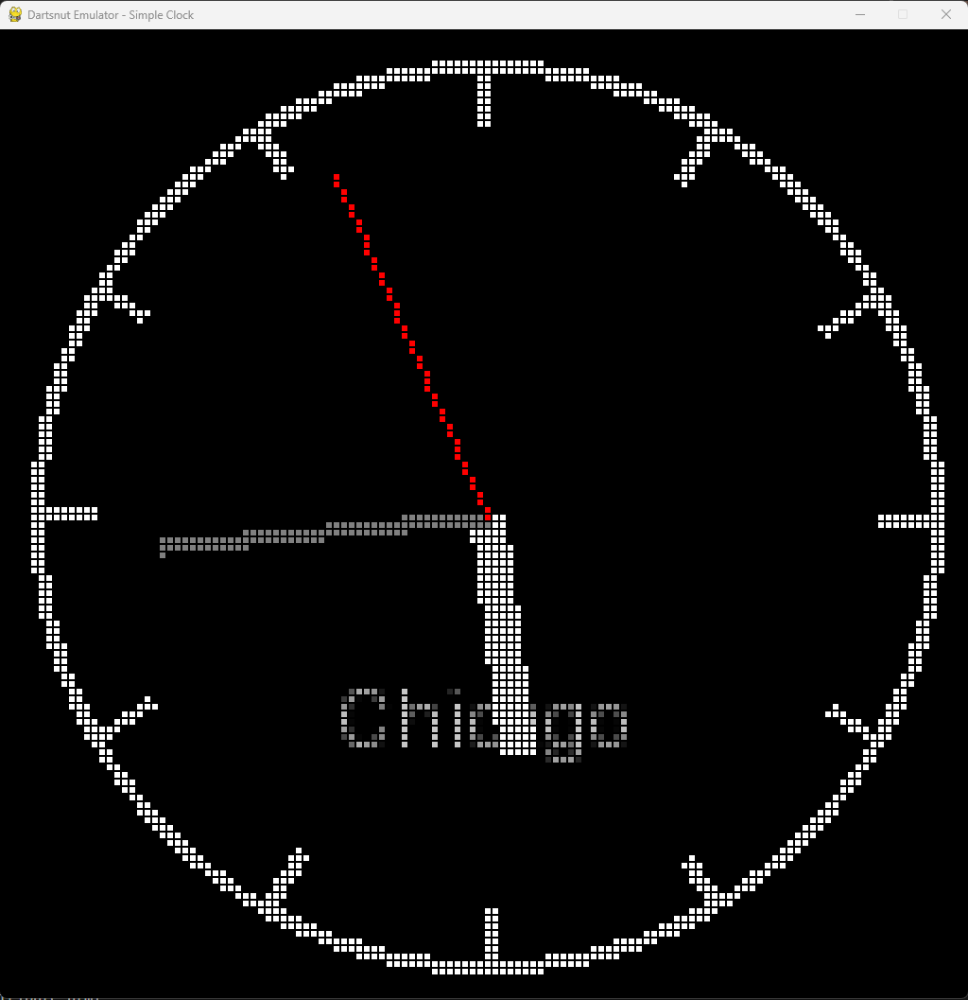
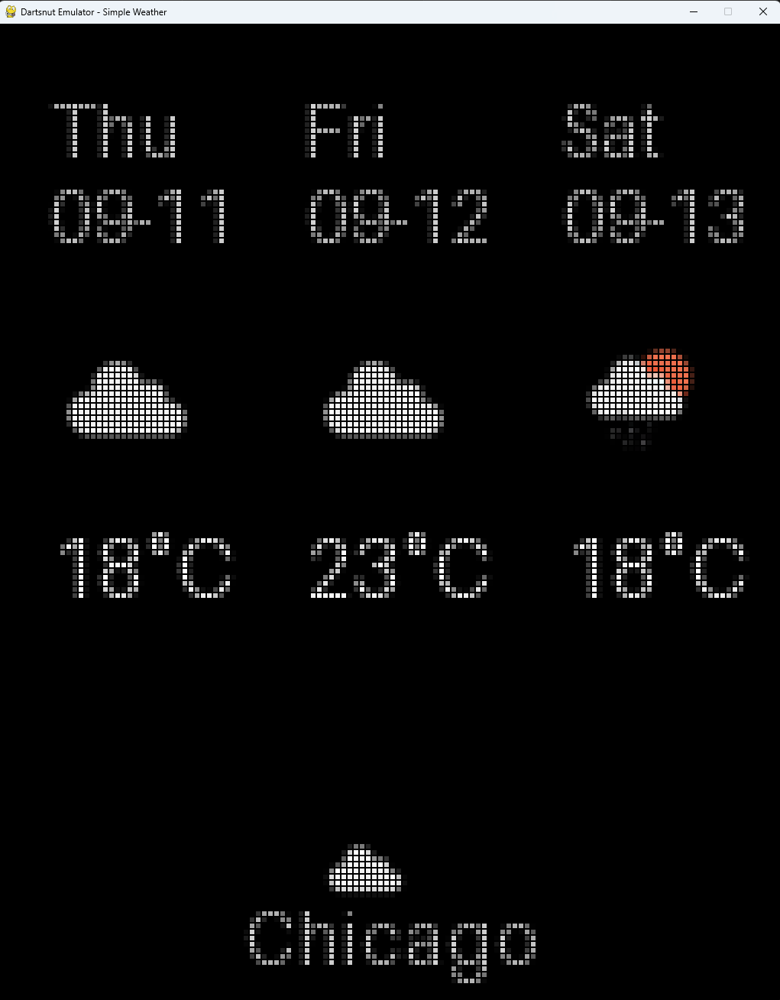

# dartsnut_emulator
The dartsnut_emulator module allows developers to create and test widgets and games on Windows, simulating the environment of Dartsnut hardware. This tool streamlines development and debugging before deploying to actual devices.

## Installation

```bash
pip install -r requirement.txt
# Also install your app's Python dependencies as needed
```

## Running the Emulator

```bash
python emulator.py --path your_app_relative_path --params your_app_params_json
```

## Usage

- **Mouse left click:** Emulate a dart hit (default: dart 1).
- **F1–F12:** Select dart index 1–12 for hits.
- **Mouse right click (same position):** Remove dart from that position.
- **Mouse double right click:** Remove all darts.
- **Keyboard (WASDKL):** Emulate Pixel Dart buttons:
    - `W` = Up
    - `A` = Left
    - `S` = Down
    - `D` = Right
    - `K` = Button A
    - `L` = Button B

## Examples

```bash
python emulator.py --path "example/simple_clock_128_128" --params '{\"city\":\"chicago\"}'
```


```bash
python emulator.py --path "example/simple_weather_128_160" --params '{\"city\":\"chicago\"}'
```


