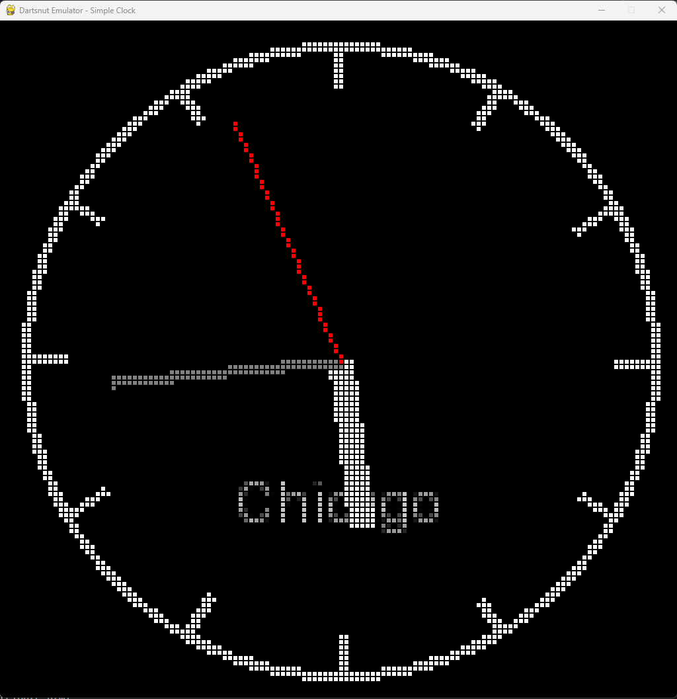
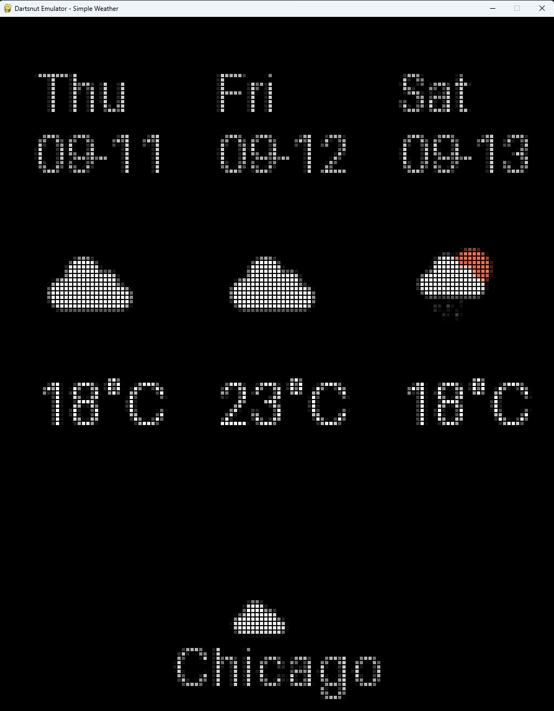

# dartsnut_emulator
The dartsnut_emulator module allows developers to create and test widgets and games on Windows, simulating the environment of Dartsnut hardware. This tool streamlines development and debugging before deploying to actual devices.

## Installation

```bash
pip install -r requirement.txt
# Also install your app's Python dependencies as needed
```

## Running the Emulator

You can run the emulator with or without command-line arguments:

- **With arguments** (pre-load a program at startup):
  ```bash
  python emulator.py --path your_app_relative_path [--params your_app_params_json]
  ```
  `--path` and `--params` are optional. If you omit `--path`, the emulator starts with no widget loaded.

- **Without arguments**: Start the emulator, then use **File → Open program…** to choose a program directory (a folder containing `conf.json` and `main.py`). You can optionally enter a JSON params string (e.g. `{}` or `{"city":"chicago"}`).

## Usage

- **File → Open program…**: Choose a program directory and optional params (same as `--path` and `--params` on the CLI).
- **File → Screenshot**: Save a screenshot to the `capture/` folder (same as pressing P).
- **Program → Restart**: Restart the program subprocess (same as pressing R).
- **Mouse left click (or drag):** Emulate a dart hit (default: dart 1).
- **F1–F12:** Select dart index 1–12 for hits.
- **Mouse right click (same position):** Remove dart from that position.
- **Mouse double right click:** Remove all darts.
- **Keyboard (WASDKL):** Emulate Pixel Dart buttons:
    - `W` = Up
    - `A` = Left
    - `S` = Down
    - `D` = Right
    - `K` = Button A
    - `L` = Button B

## Examples

Run without arguments, then use File → Open program to pick a program:

```bash
python emulator.py
```

Or pre-load a widget via CLI:

```bash
python emulator.py --path "example/simple_clock_128_128" --params '{\"city\":\"chicago\"}'
```


```bash
python emulator.py --path "example/simple_weather_128_160" --params '{\"city\":\"chicago\"}'
```


